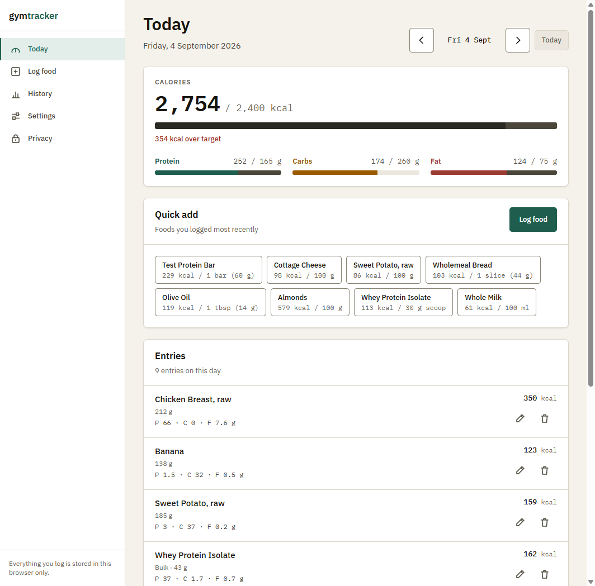
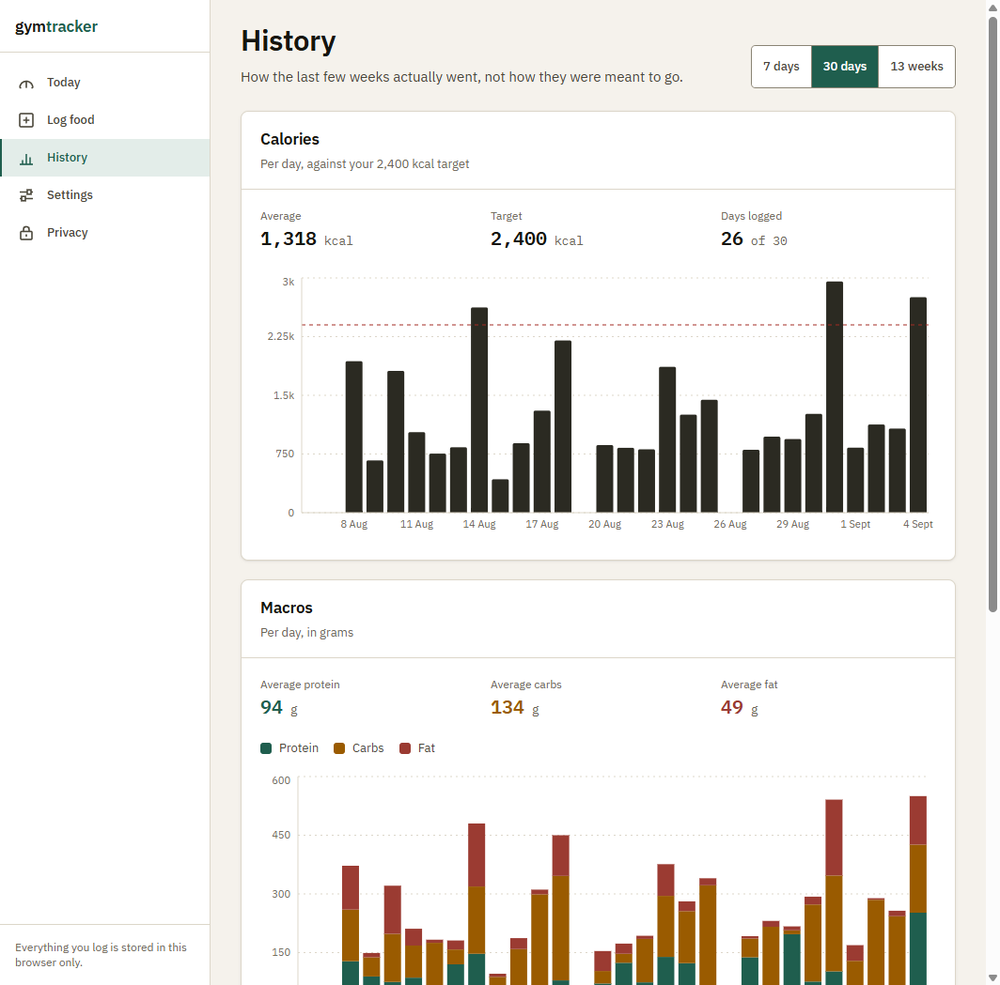

# gymtracker

A calorie and macro tracker that keeps personal entries in your browser. No account or cloud
sync. Cloudflare serves the website. Barcode lookups check saved foods first and contact Open
Food Facts only when there is no local match. Personal logs are not uploaded.



## Scope

This tracks food. It records what you ate, adds up calories and macronutrients, compares them to
targets you set, and charts the result over time. It also records body weight, because that is the
number most people want next to their calorie history.

It does not log workouts, exercises, sets or reps, and it is not going to. Those belong in a
different application.

## Screens

| Screen   | What it is for                                                                                                                                                                                     |
| -------- | -------------------------------------------------------------------------------------------------------------------------------------------------------------------------------------------------- |
| Today    | Progress against your daily targets, one tap re-logging of recent foods, and the day's entries with edit and delete. The day can be stepped backwards and forwards, so past days can be corrected. |
| Log food | Search your saved foods by name or brand, scan a barcode, or add something new by hand.                                                                                                            |
| History  | Daily calories against your target, macros stacked in grams, and the body weight trend, over 7 days, 30 days or 13 weeks.                                                                          |
| Settings | Daily targets, body weight entry, export, import, and delete everything.                                                                                                                           |
| Privacy  | What is stored, where, and the one thing that leaves the device.                                                                                                                                   |



## Running it

Requires Node 20.19 or newer.

The HTTP regression script (`npm run check:http`) uses native TypeScript support and requires
Node 22.18 or newer. CI uses Node 22. It tests the network boundary without external requests,
including stalled response bodies, byte limits, malformed responses and rejected destinations.

```bash
npm install
npm run dev
```

The dev server runs at `http://localhost:5173`. That counts as a secure context, so the camera
works there without HTTPS.

| Script                   | What it does                                                           |
| ------------------------ | ---------------------------------------------------------------------- |
| `npm run dev`            | Vite dev server                                                        |
| `npm run build`          | Typecheck, then build to `dist/`                                       |
| `npm run preview`        | Serve the built output with the full production security headers       |
| `npm run typecheck`      | TypeScript in strict mode                                              |
| `npm run lint`           | ESLint, including the security rules below                             |
| `npm run check:tokens`   | Fails on arbitrary lengths or colour literals outside the token file   |
| `npm run check:contrast` | Asserts the palette against WCAG 2.1 AA                                |
| `npm run check:all`      | All four of the above                                                  |
| `npm run icons`          | Regenerates the favicon PNG and ICO files from one geometry definition |

## Design

The design system lives in `src/styles/tokens.css` and is the single source of truth for every
colour, type step, spacing value, radius and shadow in the application. Tailwind's stock palette
and breakpoints are reset to `initial` there, so the only colours that exist are project colours,
and a component cannot quietly reach for `bg-slate-400`.

Two scripts keep it honest rather than aspirational:

- `check:contrast` reads the palette out of `tokens.css` and asserts 29 foreground and background
  pairs against WCAG 2.1 AA, 4.5:1 for text and 3:1 for interactive boundaries. All 29 pass.
- `check:tokens` fails the build if an arbitrary length such as `p-[13px]` ever appears in a class
  name, or if a colour literal appears anywhere outside the token file. It also asserts that the
  fallback values in `chartTheme.ts` match `tokens.css` exactly, so the charts cannot drift from
  the rest of the interface.

Both run in CI.

### Type

**IBM Plex Sans** for interface text, **IBM Plex Mono** for every figure the user reads.

Plex Sans was drawn for dense technical interfaces, and its lowercase has enough character to not
read as a default: the flat-sided `a`, the angled terminals, the slightly narrow `g`. It is
deliberately not Inter, which has become the house face of every product built since about 2020 and
now reads as an absence of a decision rather than a decision.

The mono face earns its place on function rather than variety. Numbers in this application change
constantly as you log food, and in a proportional face a column of calorie totals jitters
horizontally every time a digit changes width. Plex Mono has fixed width digits, so a column stays
a column. Because it comes from the same superfamily it shares the metrics, x-height and stroke
weight of the sans, so a figure set in it sits inside a sentence without looking pasted in.

Both are installed as npm packages and bundled by Vite. Nothing is fetched from a font CDN.

The type scale is explicit and fixed in `tokens.css`, roughly a 1.24 ratio from 11px to 39px. Body
text is 15px, which is deliberately not a framework default.

### Colour

A warm paper ground (`#F5F2EC`) rather than the usual blue grey, so the data colours read as
printed rather than as screen chrome. A deep pine accent (`#1F5E4E`) for actions and active
navigation, chosen because it sits beside the food data colours without competing with them.

The three macro colours are distinct in hue **and** in lightness, so the charts stay readable in
greyscale and to colour blind readers rather than relying on hue alone:

| Token     | Value     | Used for     |
| --------- | --------- | ------------ |
| `energy`  | `#2B2A22` | Calories     |
| `protein` | `#1F5E4E` | Protein      |
| `carb`    | `#9A5B00` | Carbohydrate |
| `fat`     | `#9B3B32` | Fat          |
| `weight`  | `#35566E` | Body weight  |

Red is reserved for genuine problems. Passing a macro target is not one, so a progress bar that
goes past its target rescales and draws the excess in neutral graphite instead. Reusing the error
colour on all four bars would make the same paint mean four different things.

There is one theme, light, executed properly. A dark theme is listed under known issues rather
than shipped badly.

### Spacing and shape

A 4px base scale, using the steps 4, 8, 12, 16, 24, 32, 48, 64 and 96. Nothing in between, and
nothing arbitrary, which `check:tokens` enforces.

Corners are small: 3px, 5px and 8px. Controls are rectangles with softened corners, never pills.
Hover changes background and border colour, never opacity.

### Icons

Hand drawn, in `src/components/icons.tsx`. One 20 unit grid, one 1.6 stroke weight, butt caps and
miter joins throughout. The squared terminals are deliberate: they match the rectangular language
of the cards and controls, rather than the rounded terminals common to off the shelf icon sets.

The favicon is generated from the same geometry as `public/favicon.svg` by `scripts/generate-icons.mjs`,
which rasterises it to PNG and ICO with 4x supersampling and writes the PNG chunks directly. It
has no image library dependency, and the SVG and the bitmaps cannot drift apart.

### Accessibility

- Every foreground and background pair is checked against WCAG 2.1 AA by a script, not by eye.
- One focus indicator, a 2px `#0B4F9E` outline with a 2px offset, applied through `:focus-visible`
  and never removed.
- A skip link, labelled form fields with `aria-describedby` for hints and errors, and live regions
  that are mounted before their content changes rather than appearing with it.
- Charts are described by a `figcaption` and every figure they draw is also printed as text above
  them, so the data does not depend on interpreting a graphic.
- Touch targets are 44px for primary controls and never below the 24px WCAG 2.2 minimum.

## Architecture

```
src/
  db/          Dexie schema and every typed query. The only path into IndexedDB.
  components/  Presentational and interactive components, including charts/.
  pages/       One file per route.
  lib/         Validation, dates, nutrition maths, HTTP, backup, store, design helpers.
  types/       Shared record shapes.
```

### Data model

Four tables: `foods`, `foodLogs`, `bodyWeightLogs` and `settings`.

A food holds nutrition per serving, plus the serving's weight in grams when it is known, which is
what makes logging by weight possible.

A log entry holds a **snapshot** of the totals at the moment it was saved, not a reference to the
food. Editing a food later, or deleting it, therefore cannot rewrite history. Entries also keep the
food id so they can still be re-scaled from the source when it does still exist.

Body weight is always stored in kilograms. Kilograms or pounds is a display preference applied at
the edge, so switching it never rewrites a record.

### State

`zustand` holds interface state only: which day is on screen, and the transient confirmation
message. Stored data is read straight from IndexedDB through Dexie's live queries, so there is one
source of truth for it. Mirroring records into the store would create a second one that could fall
out of step.

## Open Food Facts

The integration was written against the live API rather than from memory. Confirmed behaviour:

```
GET https://world.openfoodfacts.org/api/v2/product/{barcode}?fields=...
```

- `Access-Control-Allow-Origin: *` on both the GET and the OPTIONS preflight, so browser calls
  work without a proxy.
- Open Food Facts asks callers to identify themselves with a custom `User-Agent`. Browsers forbid
  setting that header from `fetch`, and the API's `Access-Control-Allow-Headers` list names
  `X-User-Agent`, which is what this app sends instead. The preflight is cached for 20 days
  (`Access-Control-Max-Age: 1728000`), so it costs one extra request roughly every three weeks.
- A product that does not exist returns **HTTP 200** with `status: 0` and no `product` key. The
  HTTP status alone is not a sufficient check, so success here is decided by the presence of a
  `product` that passes validation.
- The documented rate limit is 15 product reads per minute per IP. A local throttle of one lookup
  per 1.2 seconds keeps this an order of magnitude clear of it and fails locally rather than
  earning a 429.

Product images are deliberately not loaded. That keeps the content security policy's `img-src` to
`'self' data:` and means the privacy claims above stay exactly true.

A lookup prefills the food form for review rather than writing straight to the database, because
Open Food Facts records are community edited and often incomplete.

### Bundle

Everything is bundled locally, so the download size is a real design constraint rather than
someone else's problem. The two heaviest dependencies are loaded only when they are actually
needed:

| Chunk           | Raw    | Gzipped | Loaded                         |
| --------------- | ------ | ------- | ------------------------------ |
| Initial         | 428 kB | 132 kB  | Always                         |
| History         | 381 kB | 108 kB  | On opening History (Recharts)  |
| Barcode scanner | 482 kB | 124 kB  | On opening the scanner (ZXing) |

Splitting those two out took the initial download from 365 kB gzipped to 132 kB. Someone who never
opens History and never scans a barcode never downloads either library.

## Security

The full policy is in the source and enforced by tooling, not by review discipline. The load
bearing parts:

- **`src/lib/http.ts` is the only file allowed to call `fetch`**, enforced by an ESLint
  `no-restricted-syntax` rule on every other file. It checks the request origin against an
  allowlist of exactly one entry, applies an `AbortController` timeout, rejects non-JSON and
  oversized responses, and converts every failure into a named kind. Callers never receive a raw
  error, a stack, or a response body, so nothing from the network can be rendered.
- **ESLint bans** `dangerouslySetInnerHTML`, `innerHTML`, `outerHTML`, `insertAdjacentHTML`,
  `document.write`, `eval`, `new Function` and implied eval. None appear in the codebase, and the
  build fails if one is added.
- **Every write to IndexedDB goes through a zod schema** in `src/db/queries.ts`, which is the only
  path into the database. Numbers are explicitly checked for finiteness, given sane bounds, and
  strings are capped and stripped of control and bidirectional override characters.
- **Numeric input is parsed by a regex before `Number()` sees it**, which rejects exponent
  notation, hex literals, the strings `Infinity` and `NaN`, signs and whitespace padding.
- **Barcodes** must be digits only, a supported length (EAN-8, UPC-A, EAN-13) and carry a valid GS1
  check digit before a URL is built. Dynamic URL segments are passed through `encodeURIComponent`.
- **Import** parses inside a `try`/`catch`, rejects `__proto__`, `constructor` and `prototype` as
  keys at any depth, validates the whole structure with zod including per-table caps, rebuilds
  every record field by field with no spread of untrusted data, and writes inside a single
  transaction so a failure rolls back untouched.
- **The camera** is only ever reached from a click, every track is stopped on close, unmount and
  `pagehide`, and frames are decoded locally and discarded.
- **No CDN at runtime.** Fonts and every dependency are bundled by Vite.

### Deployment headers

`vite.config.ts` is the single source of truth for the security headers. `npm run build` injects
the policy as a meta tag into `dist/index.html` and emits `dist/_headers`, which Netlify and
Cloudflare Pages read directly. `npm run preview` serves the same headers, so the policy can be
tested against the real production bundle.

```
Content-Security-Policy: default-src 'self'; base-uri 'self'; object-src 'none';
  frame-ancestors 'none'; frame-src 'none'; form-action 'self'; script-src 'self';
  style-src 'self'; style-src-attr 'unsafe-inline'; img-src 'self' data:; font-src 'self';
  media-src 'self' blob:; worker-src 'self' blob:; manifest-src 'self';
  connect-src 'self' https://world.openfoodfacts.org; upgrade-insecure-requests
X-Content-Type-Options: nosniff
Referrer-Policy: no-referrer
Permissions-Policy: camera=(self), geolocation=(), microphone=(), payment=(), usb=()
Cross-Origin-Opener-Policy: same-origin
X-Frame-Options: DENY
Strict-Transport-Security: max-age=63072000; includeSubDomains
```

`style-src-attr 'unsafe-inline'` is the single relaxation, and it is narrow on purpose. Recharts
writes inline `style` attributes onto the SVG nodes it renders, and blocking style attributes
outright breaks chart sizing and tooltips. Scoping `'unsafe-inline'` to `style-src-attr` permits
style **attributes** only. It does not permit `<style>` elements, imported stylesheets, or CSSOM
injection, all of which stay restricted to `'self'` by `style-src`. `script-src` has no relaxation
at all.

Serve over HTTPS. `getUserMedia` requires a secure context, so the barcode scanner will not work
over plain HTTP on anything other than `localhost`.

`frame-ancestors` is ignored inside a meta tag, so a host that cannot set real response headers
gets everything except clickjacking protection. Use a host that can.

## Honest limitations

These are properties of the design, not bugs. They are stated on the Privacy screen too.

**Your data is stored unencrypted.** IndexedDB holds it in plain form inside your browser profile.
Anyone who can use this device while you are logged in, or who can read the browser profile folder
from disk, can read your entire food log. This application cannot prevent that. If it matters, rely
on your operating system account password and full disk encryption.

**Clearing browser data deletes everything, permanently.** There is no server and therefore no
backup. Clearing site data, running a cleanup tool, or using private browsing wipes your whole
history with no way to recover it. Browsers may also evict storage on their own when a device runs
low on space. Export a backup from Settings regularly and keep the file somewhere you trust.

**It is single user and single device.** There is no account system, no login, no sync, and no
server side protection of any kind. Anyone who opens the app in this browser profile sees your log.
Opening it on another device shows an empty database.

**Barcode numbers are sent to Open Food Facts.** When you scan or type a barcode, that number goes
to `world.openfoodfacts.org`, which also sees your IP address as any web request would. Nothing
else is ever transmitted: not your food log, not your weight, not your targets, and no identifier
for you or your device. If you never scan a barcode, the application makes no network requests at
all.

## Known issues and rough edges

- **No dark theme.** One light theme is executed properly instead of two done adequately. Adding
  one means a second full pass of the contrast script and every screen.
- **No offline service worker.** The app works without a network once loaded, but a hard reload
  while offline will fail. It is a static bundle, so a service worker would be straightforward.
- **Search is a bounded table scan** past the indexed prefix match. Fine for a personal food list
  of hundreds; it would want a proper index at tens of thousands.
- **Import replaces rather than merges.** This is deliberate, because merging two histories raises
  questions about duplicates that have no obviously right answer, but it does mean you cannot
  combine two devices' logs.
- **No Open Food Facts text search**, only barcode lookup. Their search endpoint has a tighter rate
  limit (10 per minute) and would need its own throttling and result validation.
- **The 13 week view aggregates to weekly averages**, so a single unusual day is invisible at that
  range. The 30 day view shows every day.
- **Recharts' `ResponsiveContainer` is not used**, because it was observed leaving a stale width on
  its wrapper when the viewport narrowed. `ChartCanvas` measures its own box instead. If that bug is
  fixed upstream, this could be simplified.

## Licence

MIT.
